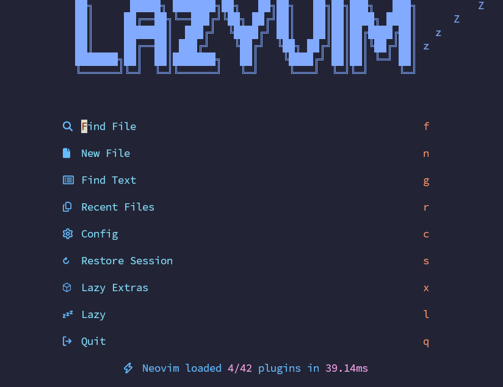

# Guide to Set Up LazyVim in WSL Ubuntu

## Install Neovim

```bash
curl -LO https://github.com/neovim/neovim/releases/latest/download/nvim-linux64.tar.gz
sudo tar -C /usr/local/ -xzf nvim-linux64.tar.gz --strip-components=1
rm nvim-linux64.tar.gz
```

## Install LazyVim

```bash
git clone https://github.com/LazyVim/starter ~/.config/nvim
rm -rf ~/.config/nvim/.git
```

Removing the `.git` folder allows you to add LazyVim template to your GitHub account.

## Install Nerd Fonts

Install fonts in Windows

1. Download Nerd Fonts `.zip` file on Windows. E.g., SauceCodePro Nerd Fonts.
1. Extract the `.zip` file contents into a folder.
1. Go to Windows Settings menu > Personalisation > Fonts.
   - Notice the dotted rectangle in the Fonts screen.
1. Select all the TrueType font `.ttf` files, drag and drop to the dotted rectangle in Fonts screen.

Configure WSL Ubuntu profile in Windows Terminal to use Nerd Fonts.

1. Open Windows Terminal app.
1. Go to Settings.
1. On the left hand side, under `Profiles` section, select the Ubuntu profile. E.g., Ubuntu-22.04.
1. On the right hand side, under `Additional settings` section, select `Appearance`.
1. In the `Appearance` page, go to `Text` > `Font face`.
   1. Check the `Show all fonts` checkbox.
   1. Select `SauceCodePro Nerd Fonts` and click `Save`.

## Open Neovim

Re-open Windows Terminal > Ubuntu.

```bash
nvim
```

You will be greeted with the LazyVim main screen below.



To exit, press `q`.

## References

- [Neovim Website](https://neovim.io/)
- [Neovim Install Guide](https://github.com/neovim/neovim/blob/master/INSTALL.md)
- [Nerd Fonts Website](https://www.nerdfonts.com/)
